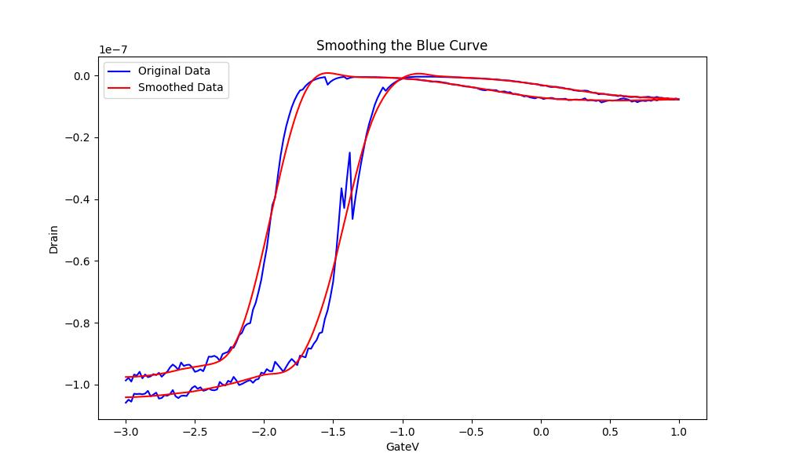
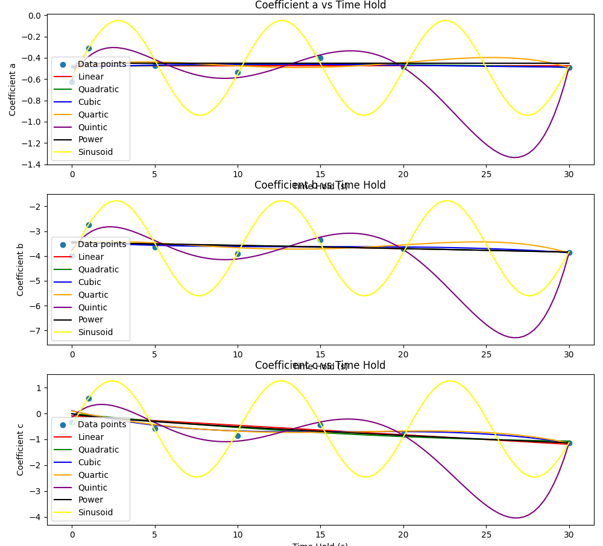

---
author:
- 戚一嘉豪 2200012732
bibliography:
- references.bib
date: 2024-10-04
title: "应用物理实践探究2: Experiment Part"
---

# Experiment Goal

Given the numerous advantages of using carbon nanotubes (CNTs) over
traditional materials, as demonstrated in the literature review, it is
essential to develop an analytical model for micro carbon nanotube
devices. This model will allow us to simulate their electrical
performance under various environmental conditions on a computer,
eliminating the need for physical experiments. Furthermore, an
analytical model for CNTs will enable us to leverage their hysteresis
properties to achieve reservoir computing, which is highly efficient for
temporal signal processing [@zhong2021dynamic]. Therefore, the ultimate
goal of this experiment is to establish a robust and practical
analytical model that accurately captures the hysteresis phenomenon in
CNTs.

{width="50%"}

# Experiment Methodology And Results

## Smoothing Data

After receiving data from Senior Liu and plotting the I-V transition
curve for CNTs, I noticed some apparent noise and non-idealities, likely
due to defects in the device or the CNTs themselves. Therefore, the
first step is to eliminate the existing noise and restore a smooth and
ideal curve from the original data for further usage.

### Smoothing DrainI

For this experiment, I used the Savitzky-Golay filter to fit a
polynomial curve to the DrainI versus GateV data, with a window width of
11 and a polynomial order of 5. Generally speaking, this approach
yielded satisfactory results. However, I observed that using a single
filter with a high polynomial order could lead to unwanted over-fitting.

To address this, I employed a multi-step filtering process. Initially, I
applied filters with a small window width and high polynomial order to
capture the original features as many as possible. Subsequently, I used
filters with a larger window width and lower polynomial order to reduce
noise while preserving the essential characteristics of the data. This
step-by-step filtering process helps mitigate over-fitting and
effectively smooth out the noise while maintaining the integrity of the
original data features.

    # Apply Savitzky-Golay filter to smooth the data
    drain_smoothed = savgol_filter(drain, 11, 4)
    G_values_smoothed = savgol_filter(G_values_filtered, 11, 4)

    #smooth again
    drain_smoothed = savgol_filter(drain_smoothed, 21, 3)
    G_values_smoothed = savgol_filter(G_values_smoothed, 21, 3)

    #smooth again
    drain_smoothed = savgol_filter(drain_smoothed, 41, 2)
    G_values_smoothed = savgol_filter(G_values_smoothed, 41, 2)

The main code looks like this and finally I received a well-smoothed
curve for DrainI versus GateV as is shown below.

{width="75%"}

### Smoothing Gm

Because using simple Savitzky-Golay filters to smooth DrainI works out
fine, I try to implement the same methodology onto smoothing
Gm($Defination: Gm = \frac{\partial DrainI}{\partial GateV}$).

{width="75%"}

Although this approach works to some degree, it cannot be considered an
ideal smoothing method for $G_m$ due to its failure to accurately fit
the peaking parts and its introduction of oscillations.

To address this issue, I revisited the original definition of $G_m$ and
attempted to recalculate its values from the ideally smoothed DrainI
versus GateV data. However, I encountered problems at both ends of the
curve, and this method did not perform well in the middle either, as
shown below.

{width="75%"}

As I observe, it seems that the $1\%$ outliers in the data set distort
the overall structure and lead to these minor oscillations.

So I use the following code to filter $1\%$ outliers.

    # Calculate the 1st and 99th percentiles to identify the outliers
    upper_bound = np.percentile(G_values, 99)
    lower_bound = np.percentile(G_values, 1)

    # Create a mask to filter out the outliers
    mask = (G_values < upper_bound) & (G_values > lower_bound)

    # Apply the mask to G_values_tempt and gate_v to remove the outliers
    G_values_filtered = G_values[mask]
    gate_v_filtered = gate_v[mask]

{width="75%"}

After filtering $1\%$ non-ideal outliers, I subsequently use
Savitzky-Golay filter to fit a curve for this and finally it ends up
being acceptable.

{width="75%"}

## Fitting Gm

As is shown in this paper[@zhong2021dynamic], memristors have the same
hysteresis phenomenon as well as CNTs and the author has already
proposed an fitted analytical expression for memristors' Gm over GateV,
which appears something like this.
$$G = G_0 + r(G' - G_0) + \frac{\alpha |V|}{\alpha |V| + 1} (G_{\text{th}} - G'),$$
where $I$, $V$, $G$, and $G'$ represent the output current, input
voltage, the conductance at the current time step, and the conductance
at the previous time step, respectively. $K$ and $G_{\text{th}}$ are the
parameters varied with $V$. When $V$ is positive, $K$ and
$G_{\text{th}}$ equal to $K_p$ and 1, respectively. When $V$ is
negative, $K$ and $G_{\text{th}}$ equal to $K_n$ and 0, respectively.

   **Parameters**   $G_0$   $r$    $\alpha$   $K_p$   $K_n$
  ---------------- ------- ------ ---------- ------- -------
     **Values**      0.5    0.99     0.23     9.13    0.32

However, when I attempted to apply the same analytical expression with
the given parameters to fit the CNTs' hysteresis curve, I encountered
significant issues. The resulting curve did not resemble the original
data at all. This discrepancy might be due to a misunderstanding of the
paper, or it could indicate that the hysteresis phenomenon observed in
memristors cannot be directly applied to CNTs.

{width="75%"}

Ultimately, I had to fit $G_m$ from scratch. Initially, I used a simple
polynomial function with a manually set polynomial order to fit it and
to manifest the hysteresis phenomenon properly, I assign two different
sets of parameters to fit Gm depending on whether our GateV is
increasing or decreasing. But as expected, this approach did not yield
meaningful results.

{width="75%"}

After trying polynomial, I come to realize that this curve resembles
Gaussian distribution. So I use the following code to fit a Gaussian
curve for original data.

    def gaussian(x, a, x0, sigma):
        return a * np.exp(-(x - x0)**2 / (2 * sigma**2))
    # Fit the Gaussian function to the increasing part
    popt_inc, _ = curve_fit(gaussian, gate_v_inc, G_values_inc, p0=[1, np.mean(gate_v_inc), np.std(gate_v_inc)])
    G_values_inc_fitted = gaussian(gate_v_inc, *popt_inc)

    # Fit the Gaussian function to the decreasing part
    popt_dec, _ = curve_fit(gaussian, gate_v_dec, G_values_dec, p0=[1, np.mean(gate_v_dec), np.std(gate_v_dec)])
    G_values_dec_fitted = gaussian(gate_v_dec, *popt_dec)

Eventually, I receive a well-fitted Gaussian function to fit Gm versus
GateV, whose the increasing part appears like
$$Gm\_fitted\_increasing = 2.705\cdot 10^{-7} \cdot exp(\frac{-(GateV + 1.940)^2}{2 \cdot 0.1899^2}) (A) = 270.5 * exp(\frac{-(GateV + 1.940)^2}{7.212\times 10^{-2}}) (nA)$$
and the decreasing part appears like
$$Gm\_fitted\_decreasing = 1.959\cdot 10^{-7} \cdot exp(\frac{-(GateV + 1.415)^2}{2 \cdot 0.2716^2}) (A) = 195.9 * exp(\frac{-(GateV + 1.415)^2}{0.1475}) (nA)$$

{width="75%"}

## Fitting DrainI

The last thing left undone is to give an analytical expression to DrainI
versus GateV. And The simple discrete model of a dynamic memristor is
given as in this paper[@zhong2021dynamic]
$$DrainI = K \cdot Gm \cdot V^3$$[@zhong2021dynamic]

   **Parameters**   $G_0$   $r$    $\alpha$   $K_p$   $K_n$
  ---------------- ------- ------ ---------- ------- -------
     **Values**      0.5    0.99     0.23     9.13    0.32

Once again, the existing function for memristors did not yield valuable
results for CNTs. Consequently, I attempted to use simple polynomial
functions to fit DrainI, but this approach also ended in failure. After
carefully observing the curve for a while, I realized that a commonly
used activation function in convolutional neural networks (CNNs), called
the sigmoid function[@menon1996characterization], might suit the model
very well.

The sigmoid function is defined as:

$$sigmoid(x) = \frac{1}{1 + e^{-x}}$$

This function has an S-shaped curve that can effectively model the
transition observed in the I-V characteristics of CNTs. By leveraging
the sigmoid function, we aim to achieve a better fit and capture the
intrinsic behavior of the CNTs' hysteresis.

    def custom_func1(x, a1, b1):
        return (a1 / (1 + np.exp(b1 * (x - max_G_value_inc_gate_v))))
    def custom_func2(x, a1, b1):
        return (a1 / (1 + np.exp(b1 * (x - max_G_value_dec_gate_v))))
    # Initial guess and bounds
    initial_guess = [1e-7, 1]
    bounds = (0, [np.inf, np.inf])

    # Fit the custom function to the increasing part
    popt_inc, _ = curve_fit(custom_func1, gate_v_inc, Drain_I_inc, p0=initial_guess, maxfev=100000, bounds=bounds)
    Drain_I_inc_fitted = custom_func1(gate_v_inc, *popt_inc)

    # Fit the custom function to the decreasing part
    popt_dec, _ = curve_fit(custom_func2, gate_v_dec, Drain_I_dec, p0=initial_guess, maxfev=100000, bounds=bounds)
    Drain_I_dec_fitted = custom_func2(gate_v_dec, *popt_dec)

{width="75%"}

For the main body, the increasing part of the curve can be described by
the sigmoid function:
$$DrainI\_fitted\_increasing = \frac{9.374 \times 10^{-8}}{1 + \exp(12.46 \cdot (GateV + 1.940))} \, (A)$$

Similarly, the decreasing part of the curve can be described by another
sigmoid function:
$$DrainI\_fitted\_decreasing = \frac{9.843 \times 10^{-8}}{1 + \exp(9.476 \cdot (GateV + 1.360))} \, (A)$$

The skew values of 1.940V and 1.360V are determined by the points where
Gm varies most rapidly, representing the centers of their respective
sigmoid functions.

    max_G_value_inc_index = np.argmax(G_values_inc)
    max_G_value_inc_gate_v = gate_v_inc[max_G_value_inc_index]
    max_G_value_dec_index = np.argmax(G_values_dec)
    max_G_value_dec_gate_v = gate_v_dec[max_G_value_dec_index]

Upon analyzing the I-V characteristics of CNTs, it became apparent that
while the sigmoid function accurately models the central transition
region. However, we observe that at both ends of the curve, the sigmoid
function tends to flatten out, which does not accurately reflect the
shape of the practical curve. To address this issue, I introduced a
quadratic function to fit the difference between the sigmoid function
and the actual curve. This adjustment helps to better capture the
behavior of the curve at the extremes. The reason comes from the formula
we learned for MOSFET devices. We have
$$DrainI = A \cdot (GateV - V_T)^2$$ when the MOSFET is in the
saturation region.

    def quadratic_func(x, a, b, c):
        return a * x**2 + b * x + c

    # Fit the quadratic function to the increasing part residuals
    popt_quad_inc, _ = curve_fit(quadratic_func, gate_v_inc, Drain_I_inc - Drain_I_inc_fitted, maxfev=100000)

    # Fit the quadratic function to the decreasing part residuals
    popt_quad_dec, _ = curve_fit(quadratic_func, gate_v_dec, Drain_I_dec - Drain_I_dec_fitted, maxfev=100000)

    # Calculate the fitted quadratic values
    residuals_inc_fitted = quadratic_func(gate_v_inc, *popt_quad_inc)
    residuals_dec_fitted = quadratic_func(gate_v_dec, *popt_quad_dec)

    Drain_I_inc_fitted += residuals_inc_fitted
    Drain_I_dec_fitted += residuals_dec_fitted

{width="75%"}

As a consequence, the overall fitting curve looks like this. The overall
increasing part of the curve can be described by this mixed function:
$DrainI\_fitted\_increasing = \frac{9.374 \times 10^{-8}}{1 + \exp(12.46 \cdot (GateV + 1.940))}+1.387\times10^{-9} \cdot GateV^2+5.459\times10^{-9}\cdot GateV+4.852\times10^{-9}\, (A)$

Similarly, the decreasing part of the curve can be described by another
sigmoid function:
$DrainI\_fitted\_decreasing = \frac{9.843 \times 10^{-8}}{1 + \exp(9.476 \cdot (GateV + 1.360))}+3.160\times10^{-9} \cdot GateV^2+7.653\times10^{-9}\cdot GateV+1.257\times10^{-9}\, (A)$

To further improve fitting accuracy, I attempted to introduce the
channel length modulation effect. This effect adds a linear term to the
overall function in the saturation region, turning it into a piece-wise
expression.

    def piecewise_func(x, a, b, c, d, e, f, x1, x2):
        linear_part1 = d * x + e
        quadratic_part = a * x**2 + b * x + c
        linear_part2 = f * x + e
        
        return np.piecewise(x,
                            [x < x1, (x >= x1) & (x <= x2), x > x2],
                            [linear_part1, quadratic_part, linear_part2])

However, this approach failed after all, possibly because there are too
many parameters to determine simultaneously, making it challenging to
achieve covariance.

## Validation

### Smoothing Methodology's Reliability

{width="49%"}
{width="49%"}
{width="49%"}

### Fitting DrainI's Effectiveness

{width="49%"}
{width="49%"}

## Considering Maximum Voltage Duration

Given all the achievements I made in building a model for the hysteresis
phenomenon in CNTs, there's still a practical problem to be solved. When
we apply a cyclical voltage from -3V to +3V and back to -3V, aiming to
use CNTs' hysteresis phenomenon for reservoir computing, it is necessary
to understand how the DrainI-GateV transition curve changes concerning
the maximum voltage duration (e.g., 0s, 1s, 5s). My previous model
neglected this phenomenon, as it solely used data with a maximum voltage
duration of 30s.

Therefore, I have made some modifications to the model to adapt to this
phenomenon.

### More Accurate Model

As I observed, if we divide the entire data into four sections and we
use four different functions to fit, we can achieve further accuracy
improvements.

**GateV increasing: DrainI increasing([Sigmoid
Function1]{style="color: green"}), DrainI decreasing([Quadratic
Function1]{style="color: orange"})**

**GateV decreasing: DrainI increasing([Quadratic
Function2]{style="color: violet"}), DrainI decreasing([Sigmoid
Function2]{style="color: blue"})**

1.  [Quadratic Function 1]{style="color: orange"}:
    $$\text{DrainI} = 5.9933 \cdot \text{GateV}^2 + 28.9688 \cdot \text{GateV} + 37.2517$$
    for $\text{GateV}$ ranging from $-3$ to $-2.4$.

2.  [Sigmoid Function 1:]{style="color: green"}
    $$\text{DrainI} = \frac{8.2276}{1 + e^{-1.2163 \cdot (\text{GateV} + 1.4576)}}$$
    for $\text{GateV}$ ranging from $-2.4$ to $3$.

3.  [Sigmoid Function 2:]{style="color: blue"}
    $$\text{DrainI} = \frac{8.4944}{1 + e^{-1.1495 \cdot (\text{GateV} + 0.2324)}}$$
    for $\text{GateV}$ ranging from $3$ to $-1.08$.

4.  [Quadratic Function 2:]{style="color: violet"}
    $$\text{DrainI} = -0.5301 \cdot \text{GateV}^2 - 4.0575 \cdot \text{GateV} - 1.3427$$
    for $\text{GateV}$ ranging from $-1.08$ back to $-3$.

{width="75%"}

### Fitting Switching Point

However, upon closer inspection of the original data, we can observe
that the switching points---where we should transition from [Quadratic
Function1]{style="color: orange"} to [Sigmoid
Function1]{style="color: green"} and from [Sigmoid
Function2]{style="color: blue"} to [Quadratic
Function2]{style="color: violet"}---vary depending on the maximum
voltage duration, as shown in the table.

   **Time Hold (s)**   **Switch Point Quad to Sigmoid**   **Switch Point Sigmoid to Quad**
  ------------------- ---------------------------------- ----------------------------------
          20                       -2.3856                            -1.0476
          10                       -2.2326                            -0.9917
           5                       -2.1179                            -0.9513
           1                       -2.0078                            -0.9129
           0                       -1.9777                            -0.9025

  : Switch Points for Various Time Holds

{width="100%"}

$$\begin{aligned}
\text{Switch Point Quad1 to Sigmoid1}(t) &= 5.0991 \times 10^{-4} \cdot t^2 - 3.0594 \times 10^{-2} \cdot t - 1.9777 \\
\text{Switch Point Sigmoid2 to Quad2}(t) &= 1.6642 \times 10^{-4} \cdot t^2 - 1.0581 \times 10^{-2} \cdot t - 0.90253
\end{aligned}$$

But if we simply make switch point change with above formula, we may
receive this.

{width="100%"}

We can see that the transition from the quadratic to the sigmoid
function will be undesirably abrupt. Additionally, as we observe, DrainI
for a given GateV will change with respect to the time hold. Therefore,
we should modify the parameters of the previous piece-wise functions to
account for the small changes arising from variations in the time hold.

### Adjust Parameters of Piece-wise Function

We receive the following piece-wise function with parameters described
by quadratic functions concerning time hold.

1.  **Quadratic Function 1:**
    $$\text{DrainI} = a \cdot \text{GateV}^2 + b \cdot \text{GateV} + c$$
    where
    $$a(\text{time\_hold}) = -0.0122 \cdot \text{time\_hold}^2 + 0.5354 \cdot \text{time\_hold} + 0.4488$$

    $$b(\text{time\_hold}) = -0.0637 \cdot \text{time\_hold}^2 + 2.8292 \cdot \text{time\_hold} - 0.9410$$

    $$c(\text{time\_hold}) = -0.0783 \cdot \text{time\_hold}^2 + 3.5384 \cdot \text{time\_hold} - 1.3425$$

    for $\text{GateV}$ ranging from $-3$ to Switch-point1.

2.  **Sigmoid Function 1:**
    $$\text{DrainI} = \frac{a}{1 + e^{-b \cdot (\text{GateV} - c)}}$$
    where
    $$a(\text{time\_hold}) = -6.7689 \times 10^{-5} \cdot \text{time\_hold}^2 + 2.6083 \times 10^{-3} \cdot \text{time\_hold} + 8.2097$$

    $$b(\text{time\_hold}) = -0.0059 \cdot \text{time\_hold}^2 + 0.1057 \cdot \text{time\_hold} + 1.0616$$

    $$c(\text{time\_hold}) = 4.4283 \times 10^{-4} \cdot \text{time\_hold}^2 - 0.0236 \cdot \text{time\_hold} - 1.1406$$

    for $\text{GateV}$ ranging from Switch-point1 to $3$.

3.  **Sigmoid Function 2:**
    $$\text{DrainI} = \frac{a}{1 + e^{-b \cdot (\text{GateV} - c)}}$$
    where

    $$a(\text{time\_hold}) = 3.3668 \times 10^{-5} \cdot \text{time\_hold}^2 + 2.3747 \times 10^{-3} \cdot \text{time\_hold} + 8.3911$$

    $$b(\text{time\_hold}) = -2.9065 \times 10^{-4} \cdot \text{time\_hold}^2 + 1.0063 \times 10^{-2} \cdot \text{time\_hold} + 1.1101$$

    $$c(\text{time\_hold}) = -1.1665 \times 10^{-4} \cdot \text{time\_hold}^2 + 4.5168 \times 10^{-3} \cdot \text{time\_hold} - 0.2593$$

    for $\text{GateV}$ ranging from $3$ to Switch-point2.

4.  **Quadratic Function 2:**
    $$\text{DrainI} = a \cdot \text{GateV}^2 + b \cdot \text{GateV} + c$$
    where

    $$a(\text{time\_hold}) = -9.42 \times 10^{-5} \cdot\text{time\_hold}^2 + 0.0020\cdot\text{time\_hold} - 0.5069$$

    $$b(\text{time\_hold}) = -2.92 \times 10^{-5} \cdot \text{time\_hold}^2 - 0.0167\cdot\text{time\_hold} - 3.5193$$

    $$c(\text{time\_hold}) = 0.0023\cdot\text{time\_hold}^2 - 0.1272\cdot\text{time\_hold} + 0.4947$$

    for $\text{GateV}$ ranging from Switch-point2 back to $-3$.

{width="100%"}

The black line is original data and colorful line is adjusted piece-wise
function. We can figure out that fitting parameters a, b, c through
quadratic function might not be suitable except for [Sigmoid
Function1]{style="color: blue"}. So we have to fine-tune parameters in
other way round for the left 3 sections.

### Fine Tune [Sigmoid Function1]{style="color: green"}

$$\text{DrainI} = \frac{a}{1 + e^{-b \cdot (\text{GateV} - c)}}$$ From
Switch point1 to +3V **For a:**

{width="75%"}

We can see time hold=10s is an outlier that influences overall fitting
negatively(maybe it's not-ideal). So we exclude it from dataset.

{width="100%"}

{width="100%"}

So we finally decide:

$$\begin{aligned}
&a(time hold) = -1.65 \times 10^{-7} \cdot \text{time\_hold}^4 + 1.62 \times 10^{-5} \cdot \text{time\_hold}^3 \\
&- 5.50 \times 10^{-4} \cdot \text{time\_hold}^2 + 7.06 \times 10^{-3} \cdot \text{time\_hold} + 8.21
\end{aligned}$$

**For b:**

{width="75%"}

time hold=10s is an outlier as well, so we again exclude it.

{width="100%"}

{width="100%"}

So we finally decide: $$\begin{aligned}
b(time hold) = 1.69 \times 10^{-6} \cdot \text{time\_hold}^4 - 1.18 \times 10^{-4} \cdot \text{time\_hold}^3 \\
+ 2.54 \times 10^{-3} \cdot \text{time\_hold}^2 - 1.46 \times 10^{-2} \cdot \text{time\_hold} + 1.17
\end{aligned}$$

**For c:**

{width="75%"}

None is ideal, but power function might be ideal.

{width="75%"}

So we finally decide:
$$c(time hold) = -0.11 \cdot  time\_hold^{0.35} - 1.10$$

{width="100%"}

As we can see, [Sigmoid Function1]{style="color: green"}([green
line]{style="color: green"}) is well fitted into original data(black
line).

### Fine Tune [Quadratic Function1]{style="color: orange"}

$$\text{DrainI} = a \cdot \text{GateV}^2 + b \cdot \text{GateV} + c$$
From -3V to Switch point1

{width="50%"}

Power Function might be ideal for fitting parameters a,b,c against time
hold.

{width="75%"}

So we finally decide:
$$a(time hold) = 2.61 \cdot  time\_hold^{0.29} - 1.03$$
$$b(time hold) = 13.00 \cdot  time\_hold^{0.31} - 8.37$$
$$c(time hold) = 14.82 \cdot  time\_hold^{0.34} - 9.95$$

{width="100%"}

As we can see, [Quadratic Function1]{style="color: orange"}([orange
line]{style="color: orange"}) is well fitted into original data(black
line).

### Fine Tune [Quadratic Function2]{style="color: violet"}

$$\text{DrainI} = a \cdot \text{GateV}^2 + b \cdot \text{GateV} + c$$
From Switch point2 to -3V

{width="75%"}

We can see hugely obvious periodicity in Coefficient a, b, c versus time
hold, thus using sinusoid function to fit.

{width="75%"}

So we finally decide: $$\begin{aligned}
a(time\_hold) =  -0.50 + 0.45 \cdot \sin(0.64 \cdot \text{time\_hold} - 0.21) \\
b(time\_hold) =  -3.69 + 1.92 \cdot \sin(0.63 \cdot \text{time\_hold} - 0.11)  \\
c(time\_hold) = -0.60 + 1.86 \cdot \sin(0.62 \cdot \text{time\_hold} + 0.07)
\end{aligned}$$

{width="90%"}

As we can see, [Quadratic Function2]{style="color: violet"}([purple
line]{style="color: violet"}) is well fitted into original data.

### Overall effect

{width="100%"}

# Results and Prospects

During these experiments, I successfully developed some practical
analytical models for the hysteresis phenomenon in CNTs, which can
simulate the physical performance of a specific CNT under given
experimental conditions. However, there's still some mismatches in
DrainI when GateV goes across two Switch points. In addition, we need
more precise dataset to cross-validate our model and avoid over-fitting.

The next problem to be solved is to consider how the transition curve
might vary according to the number of scanning cycles applied to the
device.

# Appendix: Source Code

## Smoothing Data

    import pandas as pd
    import numpy as np
    from scipy.signal import savgol_filter
    import matplotlib.pyplot as plt

    # Load the data from the Excel file
    file_path = r"c:\Users\21690\Desktop\coding\Python\Research rotation lab2\Data\INVERTER-1-1-P.xls"  # Replace with your file path
    data = pd.read_excel(file_path, engine="xlrd")

    # Assuming your data has columns 'GateV' and 'Drain'
    gate_v = data['GateV']
    drain = abs(data['DrainI'])
    drain = np.log10(drain) + 12
    G_values = data['GM']
    # Calculate the 1st and 99th percentiles to identify the outliers
    upper_bound = np.percentile(G_values, 99)
    lower_bound = np.percentile(G_values, 1)

    # Create a mask to filter out the outliers
    mask = (G_values < upper_bound) & (G_values > lower_bound)

    # Apply the mask to G_values_tempt and gate_v to remove the outliers
    G_values_filtered = G_values[mask]
    gate_v_filtered = gate_v[mask]

    # Apply Savitzky-Golay filter to smooth the data
    drain_smoothed = savgol_filter(drain, 11, 4)
    G_values_smoothed = savgol_filter(G_values_filtered, 11, 4)

    #smooth again
    drain_smoothed = savgol_filter(drain_smoothed, 21, 3)
    G_values_smoothed = savgol_filter(G_values_smoothed, 21, 3)

    #smooth again
    drain_smoothed = savgol_filter(drain_smoothed, 41, 2)
    G_values_smoothed = savgol_filter(G_values_smoothed, 41, 2)

    # Plot the original and smoothed data
    plt.figure(figsize=(10, 6))
    plt.plot(gate_v, drain, label='Original Data', color='blue')
    plt.plot(gate_v, drain_smoothed, label='Smoothed Data', color='red')
    plt.xlabel('GateV/V')
    plt.ylabel('log10(DrainI/pA)')
    plt.legend()
    plt.title('Smoothing the Blue Curve')
    plt.savefig("Smoothed1.jpg")

    #plot
    plt.figure(figsize=(10, 6))
    plt.plot(gate_v, G_values, label='Original Data', color='blue')
    plt.plot(gate_v_filtered, G_values_filtered, label='Filtered Data', color='red')
    plt.xlabel('GateV')
    plt.ylabel('GM')
    plt.legend()
    plt.title('Filtering 1% Outliers')
    plt.savefig("Filtered.jpg")

    # Plot the original and smoothed data
    plt.figure(figsize=(10, 6))
    plt.plot(gate_v_filtered, G_values_filtered, label='Original Data', color='blue')
    plt.plot(gate_v_filtered, G_values_smoothed, label='Smoothed Data', color='red')
    plt.xlabel('GateV')
    plt.ylabel('GM')
    plt.legend()
    plt.title('Smoothing the Blue Curve')
    plt.savefig("Smoothed2.jpg")

    # Save the smoothed data back to Excel

    G_values = G_values_smoothed
    drain = drain_smoothed[mask]
    gate_v = gate_v_filtered
    Smoothed_data = pd.DataFrame({
        'GateV': gate_v,
        'DrainI': 10**(drain+12),
        'GM': G_values
    })
    output_file_path = r"C:\Users\21690\Desktop\coding\Python\Research rotation lab2\data\INVERTER-1-1-P_smoothed.xlsx"  # Replace with desired output path
    Smoothed_data.to_excel(output_file_path, index=False)

## Fitting Gm

    import numpy as np
    import pandas as pd
    import matplotlib.pyplot as plt
    from scipy.optimize import curve_fit
    import sys

    sys.stdout = open("Output_Fitting_G.out", "w")

    # Load the data from the Excel file
    excel_file = r"C:\Users\21690\Desktop\coding\Python\Research rotation lab2\INVERTER-1-1-P_smoothed.xlsx"  # Replace with your Excel file path
    data = pd.read_excel(excel_file)

    # Assuming the Excel file has two columns: 'GM' and 'GateV'
    G_values = pd.to_numeric(data['GM'], errors='coerce').to_numpy()
    gate_v = pd.to_numeric(data['GateV'], errors='coerce').to_numpy()

    # Remove NaN values
    mask = ~np.isnan(G_values) & ~np.isnan(gate_v)
    G_values = G_values[mask]
    gate_v = gate_v[mask]

    # Split data into increasing and decreasing parts
    increasing_mask = np.diff(gate_v, prepend=gate_v[0]) > 0
    decreasing_mask = np.diff(gate_v, prepend=gate_v[-1]) < 0
    equal_mask = np.diff(gate_v, prepend=gate_v[0]) == 0

    G_values_inc = G_values[increasing_mask]
    gate_v_inc = gate_v[increasing_mask]

    G_values_dec = G_values[decreasing_mask]
    gate_v_dec = gate_v[decreasing_mask]

    # Define the Gaussian function
    def gaussian(x, a, x0, sigma):
        return a * np.exp(-(x - x0)**2 / (2 * sigma**2))

    # Fit the Gaussian function to the increasing part
    popt_inc, _ = curve_fit(gaussian, gate_v_inc, G_values_inc, p0=[1, np.mean(gate_v_inc), np.std(gate_v_inc)])
    G_values_inc_fitted = gaussian(gate_v_inc, *popt_inc)

    # Fit the Gaussian function to the decreasing part
    popt_dec, _ = curve_fit(gaussian, gate_v_dec, G_values_dec, p0=[1, np.mean(gate_v_dec), np.std(gate_v_dec)])
    G_values_dec_fitted = gaussian(gate_v_dec, *popt_dec)

    # Combine the fitted values for plotting
    G_values_fitted = np.zeros_like(G_values)
    G_values_fitted[increasing_mask] = G_values_inc_fitted
    G_values_fitted[decreasing_mask] = G_values_dec_fitted
    G_values_fitted[equal_mask] = G_values[equal_mask]

    # Plot the original and fitted data
    plt.figure(figsize=(10, 6))
    plt.plot(gate_v, G_values, label='Original Data', color='blue')
    plt.plot(gate_v[increasing_mask], G_values_inc_fitted, label='Fitted Data (Increasing)', color='red')
    plt.plot(gate_v[decreasing_mask], G_values_dec_fitted, label='Fitted Data (Decreasing)', color='green')
    plt.xlabel('GateV')
    plt.ylabel('GM')
    plt.legend()
    plt.title('Fitting_G')
    plt.savefig("Fitting_G.jpg")

    # Save the fitted data to a new Excel file
    data['GM_Fitted'] = G_values_fitted
    output_excel_file = r"C:\Users\21690\Desktop\coding\Python\Research rotation lab2\INVERTER-1-1-P_Fitting_G.xlsx"  # Output Excel file path
    data.to_excel(output_excel_file, index=False, float_format="%.20lf", engine='openpyxl')

## Fitting DrainI

    import numpy as np
    import pandas as pd
    import matplotlib.pyplot as plt
    from scipy.optimize import curve_fit
    import sys

    sys.stdout = open("Output_Fitting_DrainI.out", "w")

    # Load the data from the Excel file
    excel_file = r"C:\Users\21690\Desktop\coding\Python\Research rotation lab2\data\INVERTER-1-1-P_Fitting_G.xlsx" 
    data = pd.read_excel(excel_file)

    # Assuming the Excel file has columns: 'GM_Fitted', 'GateV', and 'DrainI'
    G_values = pd.to_numeric(data['GM_Fitted'], errors='coerce').to_numpy()
    gate_v = pd.to_numeric(data['GateV'], errors='coerce').to_numpy()
    Drain_I = pd.to_numeric(data['DrainI'], errors='coerce').to_numpy()
    Drain_I = -Drain_I

    # Remove NaN values
    mask = ~np.isnan(G_values) & ~np.isnan(gate_v)
    G_values = G_values[mask]
    gate_v = gate_v[mask]
    Drain_I = Drain_I[mask]

    # Split data into increasing and decreasing parts
    increasing_mask = np.diff(gate_v, prepend=gate_v[0]) > 0
    decreasing_mask = np.diff(gate_v, prepend=gate_v[-1]) < 0
    equal_mask = np.diff(gate_v, prepend=gate_v[0]) == 0

    G_values_inc = G_values[increasing_mask]
    gate_v_inc = gate_v[increasing_mask]
    Drain_I_inc = Drain_I[increasing_mask]
    max_G_value_inc_index = np.argmax(G_values_inc)
    max_G_value_inc_gate_v = gate_v_inc[max_G_value_inc_index]

    G_values_dec = G_values[decreasing_mask]
    gate_v_dec = gate_v[decreasing_mask]
    Drain_I_dec = Drain_I[decreasing_mask]
    max_G_value_dec_index = np.argmax(G_values_dec)
    max_G_value_dec_gate_v = gate_v_dec[max_G_value_dec_index]

    # Define the new custom function
    def custom_func1(x, a1, b1):
        return (a1 / (1 + np.exp(b1 * (x - max_G_value_inc_gate_v))))
    def custom_func2(x, a1, b1):
        return (a1 / (1 + np.exp(b1 * (x - max_G_value_dec_gate_v))))
    def quadratic_func(x, a, b, c):
        return a * x**2 + b * x + c
    def piecewise_func(x, a, b, c, d, e, f, x1, x2):
        linear_part1 = d * x + e
        quadratic_part = a * x**2 + b * x + c
        linear_part2 = f * x + e
        
        return np.piecewise(x,
                            [x < x1, (x >= x1) & (x <= x2), x > x2],
                            [linear_part1, quadratic_part, linear_part2])

    # Initial guess and bounds
    initial_guess = [1e-7, 1]
    bounds = (0, [np.inf, np.inf])

    # Fit the custom function to the increasing part
    popt_inc, _ = curve_fit(custom_func1, gate_v_inc, Drain_I_inc, p0=initial_guess, maxfev=100000, bounds=bounds)
    Drain_I_inc_fitted = custom_func1(gate_v_inc, *popt_inc)

    # Fit the custom function to the decreasing part
    popt_dec, _ = curve_fit(custom_func2, gate_v_dec, Drain_I_dec, p0=initial_guess, maxfev=100000, bounds=bounds)
    Drain_I_dec_fitted = custom_func2(gate_v_dec, *popt_dec)

    initial_guess_piecewise = [1, 1, 1, 1, 1, 1, min(gate_v_inc), max(gate_v_inc)]  # [a, b, c, d, e, f, x1, x2]

    # Fit the quadratic function to the increasing part residuals
    popt_quad_inc, _ = curve_fit(quadratic_func, gate_v_inc, Drain_I_inc - Drain_I_inc_fitted, maxfev=100000)

    # Fit the quadratic function to the decreasing part residuals
    popt_quad_dec, _ = curve_fit(quadratic_func, gate_v_dec, Drain_I_dec - Drain_I_dec_fitted, maxfev=100000)

    # Calculate the fitted quadratic values
    residuals_inc_fitted = quadratic_func(gate_v_inc, *popt_quad_inc)
    residuals_dec_fitted = quadratic_func(gate_v_dec, *popt_quad_dec)

    Drain_I_inc_fitted += residuals_inc_fitted
    Drain_I_dec_fitted += residuals_dec_fitted

    # Combine the fitted values for plotting
    Drain_I_fitted = np.zeros_like(Drain_I)
    Drain_I_fitted[increasing_mask] = Drain_I_inc_fitted
    Drain_I_fitted[decreasing_mask] = Drain_I_dec_fitted
    Drain_I_fitted[equal_mask] = Drain_I[equal_mask]

    # Plot the original and fitted data
    plt.figure(figsize=(10, 6))
    plt.plot(gate_v, Drain_I, label='Original Data', color='blue')
    plt.plot(gate_v[increasing_mask], Drain_I_inc_fitted, label='Fitted Data (Increasing)', color='red')
    plt.plot(gate_v[decreasing_mask], Drain_I_dec_fitted, label='Fitted Data (Decreasing)', color='green')
    plt.xlabel('GateV/V')
    plt.ylabel('DrainI/A')
    plt.legend()
    plt.title('Fitting DrainI with Custom Function')
    plt.savefig("Fitting_DrainI_with_Custom_Function.jpg")

    # Save the fitted data to a new Excel file
    data['DrainI'] = Drain_I_fitted
    output_excel_file = r"C:\Users\21690\Desktop\coding\Python\Research rotation lab2\data\INVERTER-1-1-P_Fitting_DrainI.xlsx"
    data.to_excel(output_excel_file, index=False, float_format="%.20lf", engine='openpyxl')

    # Print optimal parameters
    print(f"Optimal parameters for increasing gate_v: a1 = {popt_inc[0]}, b1 = {popt_inc[1]}")
    print(f"Optimal parameters for decreasing gate_v: a1 = {popt_dec[0]}, b1 = {popt_dec[1]}")
    print(f"Optimal parameters for increasing gate_v's remaining part: a1 = {popt_quad_inc[0]}, b1 = {popt_quad_inc[1]}, c1 = {popt_quad_inc[2]}")
    print(f"Optimal parameters for decreasing gate_v's remaining part: a1 = {popt_quad_dec[0]}, b1 = {popt_quad_dec[1]}, c1 = {popt_quad_dec[2]}")

## Considering Switch Point

    import numpy as np
    import matplotlib.pyplot as plt

    # Define the piecewise functions
    def quadratic_function_1(GateV):
        return 5.9933 * GateV**2 + 28.9688 * GateV + 37.2517

    def sigmoid_function_1(GateV):
        return 8.2276 / (1 + np.exp(-1.2163 * (GateV + 1.4576)))

    def sigmoid_function_2(GateV):
        return 8.4944 / (1 + np.exp(-1.1495 * (GateV + 0.2324)))

    def quadratic_function_2(GateV):
        return -0.5301 * GateV**2 - 4.0575 * GateV - 1.3427

    # Define the fitted switching point expressions
    def switch_point_quad_to_sigmoid(time_hold):
        return 5.0991e-4 * time_hold**2 - 3.0594e-2 * time_hold - 1.9777

    def switch_point_sigmoid_to_quad(time_hold):
        return 1.6642e-4 * time_hold**2 - 1.0581e-2 * time_hold - 0.90253

    # Time hold values
    time_holds = np.array([30, 20, 15, 10, 5, 1, 0])

    # Calculate switching points for each time hold value
    switch_points_quad_to_sigmoid = switch_point_quad_to_sigmoid(time_holds)
    switch_points_sigmoid_to_quad = switch_point_sigmoid_to_quad(time_holds)

    # Define GateV ranges for the piecewise function segments
    GateV_values_1 = np.linspace(-3, -2.4, 100)
    GateV_values_2 = np.linspace(-2.4, 3, 100)
    GateV_values_3 = np.linspace(3, -1.08, 100)
    GateV_values_4 = np.linspace(-1.08, -3, 100)

    # Calculate values for the piecewise functions
    quadratic_values_1 = [quadratic_function_1(GateV) for GateV in GateV_values_1]
    sigmoid_values_1 = [sigmoid_function_1(GateV) for GateV in GateV_values_2]
    sigmoid_values_2 = [sigmoid_function_2(GateV) for GateV in GateV_values_3]
    quadratic_values_2 = [quadratic_function_2(GateV) for GateV in GateV_values_4]

    # Plot the piecewise functions for different Time Hold values
    plt.figure(figsize=(16, 12))
    for i, time_hold in enumerate(time_holds):
        switch_quad_to_sigmoid = switch_points_quad_to_sigmoid[i]
        switch_sigmoid_to_quad = switch_points_sigmoid_to_quad[i]
        
        # Define the GateV ranges for the current switching points
        GateV_quad_to_sigmoid = np.linspace(-3, switch_quad_to_sigmoid, 100)
        GateV_sigmoid_1 = np.linspace(switch_quad_to_sigmoid, 3, 100)
        GateV_sigmoid_2 = np.linspace(3, switch_sigmoid_to_quad, 100)
        GateV_quad_2 = np.linspace(switch_sigmoid_to_quad, -3, 100)
        
        # Calculate the values for the current switching points
        values_quad_to_sigmoid = [quadratic_function_1(GateV) for GateV in GateV_quad_to_sigmoid]
        values_sigmoid_1 = [sigmoid_function_1(GateV) for GateV in GateV_sigmoid_1]
        values_sigmoid_2 = [sigmoid_function_2(GateV) for GateV in GateV_sigmoid_2]
        values_quad_2 = [quadratic_function_2(GateV) for GateV in GateV_quad_2]
        
        # Plot the piecewise function for the current Time Hold value
        plt.subplot(3, 3, i + 1)
        plt.plot(GateV_quad_to_sigmoid, values_quad_to_sigmoid, label="Quadratic Function 1", color="orange")
        plt.plot(GateV_sigmoid_1, values_sigmoid_1, label="Sigmoid Function 1", color="green")
        plt.plot(GateV_sigmoid_2, values_sigmoid_2, label="Sigmoid Function 2", color="blue")
        plt.plot(GateV_quad_2, values_quad_2, label="Quadratic Function 2", color="purple")
        plt.xlabel("GateV")
        plt.ylabel("DrainI")
        plt.title(f"Time Hold: {time_hold}s")
        plt.legend()
        plt.grid(True)

    plt.tight_layout()
    plt.show()

## Fine Tune [Sigmoid Function1]{style="color: green"}'s Parameters

    import numpy as np
    from scipy.optimize import curve_fit
    import matplotlib.pyplot as plt
    import sys
    sys.stdout = open("sigmoid1 parameters.out", "w")

    # Given time_hold values and corresponding a, b, c values
    time_hold = np.array([30, 20, 15, 10, 5, 1, 0])
    a_values = np.array([8.2286, 8.2320, 8.2363, 8.2282, 8.230644590936938, 8.2151, 8.2069])
    b_values = np.array([1.2163, 1.2289, 1.2170, 1.2207, 1.1509087736691357, 1.1647, 1.1733])
    c_values = np.array([-1.4576, -1.4091, -1.3948, -1.3512, -1.2950927657426385, -1.2011, -1.0997])
    time_hold_a = np.array([30, 20, 15, 5, 1, 0])
    time_hold_b = np.array([30, 20, 15, 5, 1, 0])
    a_values_t = np.array([8.2286, 8.2320, 8.2363, 8.230644590936938, 8.2151, 8.2069])
    b_values_t = np.array([1.2163, 1.2289, 1.2170, 1.1509087736691357, 1.1647, 1.1733])

    # Define polynomial fitting functions
    def fit_linear(x, a, b):
        return a * x + b

    def fit_quadratic(x, a, b, c):
        return a * x**2 + b * x + c

    def fit_cubic(x, a, b, c, d):
        return a * x**3 + b * x**2 + c * x + d

    def fit_quartic(x, a, b, c, d, e):
        return a * x**4 + b * x**3 + c * x**2 + d * x + e

    def fit_quintic(x, a, b, c, d, e, f):
        return a * x**5 + b * x**4 + c * x**3 + d * x**2 + e * x + f
    def fit_power(x, a, b, c):
        return a * x ** b + c

    # Fit the data using different polynomial functions
    params_a_linear, _ = curve_fit(fit_linear, time_hold_a, a_values_t)
    params_a_quadratic, _ = curve_fit(fit_quadratic, time_hold_a, a_values_t)
    params_a_cubic, _ = curve_fit(fit_cubic, time_hold_a, a_values_t)
    params_a_quartic, _ = curve_fit(fit_quartic, time_hold_a, a_values_t)
    params_a_quintic, _ = curve_fit(fit_quintic, time_hold_a, a_values_t)

    params_b_linear, _ = curve_fit(fit_linear, time_hold_b, b_values_t)
    params_b_quadratic, _ = curve_fit(fit_quadratic, time_hold_b, b_values_t)
    params_b_cubic, _ = curve_fit(fit_cubic, time_hold_b, b_values_t)
    params_b_quartic, _ = curve_fit(fit_quartic, time_hold_b, b_values_t)
    params_b_quintic, _ = curve_fit(fit_quintic, time_hold_b, b_values_t)

    params_c_linear, _ = curve_fit(fit_linear, time_hold, c_values)
    params_c_quadratic, _ = curve_fit(fit_quadratic, time_hold, c_values)
    params_c_cubic, _ = curve_fit(fit_cubic, time_hold, c_values)
    params_c_quartic, _ = curve_fit(fit_quartic, time_hold, c_values)
    params_c_quintic, _ = curve_fit(fit_quintic, time_hold, c_values)
    params_c_power, _ = curve_fit(fit_power, time_hold, c_values)

    # Define a function to plot the fits
    def plot_fits_a(time_hold, values, fits, title):
        plt.figure(figsize=(12, 8))
        plt.scatter(time_hold, values, label='Data', color='black')
        x_fit = np.linspace(min(time_hold), max(time_hold), 500)
        plt.plot(x_fit, fits[0](x_fit, *params_a_linear), label='Linear fit')
        plt.plot(x_fit, fits[1](x_fit, *params_a_quadratic), label='Quadratic fit')
        plt.plot(x_fit, fits[2](x_fit, *params_a_cubic), label='Cubic fit')
        plt.plot(x_fit, fits[3](x_fit, *params_a_quartic), label='Quartic fit')
        plt.plot(x_fit, fits[4](x_fit, *params_a_quintic), label='Quintic fit')
        plt.title(title)
        plt.xlabel('Time Hold (s)')
        plt.ylabel('Values')
        plt.legend()
        plt.show()
    def plot_fits_b(time_hold, values, fits, title):
        plt.figure(figsize=(12, 8))
        plt.scatter(time_hold, values, label='Data', color='black')
        x_fit = np.linspace(min(time_hold), max(time_hold), 500)
        plt.plot(x_fit, fits[0](x_fit, *params_b_linear), label='Linear fit')
        plt.plot(x_fit, fits[1](x_fit, *params_b_quadratic), label='Quadratic fit')
        plt.plot(x_fit, fits[2](x_fit, *params_b_cubic), label='Cubic fit')
        plt.plot(x_fit, fits[3](x_fit, *params_b_quartic), label='Quartic fit')
        plt.plot(x_fit, fits[4](x_fit, *params_b_quintic), label='Quintic fit')
        plt.title(title)
        plt.xlabel('Time Hold (s)')
        plt.ylabel('Values')
        plt.legend()
        plt.show()
    def plot_fits_c(time_hold, values, fits, title):
        plt.figure(figsize=(12, 8))
        plt.scatter(time_hold, values, label='Data', color='black')
        x_fit = np.linspace(min(time_hold), max(time_hold), 500)
        '''plt.plot(x_fit, fits[0](x_fit, *params_c_linear), label='Linear fit')
        plt.plot(x_fit, fits[1](x_fit, *params_c_quadratic), label='Quadratic fit')
        plt.plot(x_fit, fits[2](x_fit, *params_c_cubic), label='Cubic fit')
        plt.plot(x_fit, fits[3](x_fit, *params_c_quartic), label='Quartic fit')
        plt.plot(x_fit, fits[4](x_fit, *params_c_quintic), label='Quintic fit')'''
        plt.plot(x_fit, fits[5](x_fit, *params_c_power), label='Power fit')
        plt.title(title)
        plt.xlabel('Time Hold (s)')
        plt.ylabel('Values')
        plt.legend()
        plt.show()

    # Plot the fits for a, b, and c values
    plot_fits_a(time_hold_a, a_values_t, [fit_linear, fit_quadratic, fit_cubic, fit_quartic, fit_quintic], 'Fits for a values')
    plot_fits_b(time_hold_b, b_values_t, [fit_linear, fit_quadratic, fit_cubic, fit_quartic, fit_quintic], 'Fits for b values')
    plot_fits_c(time_hold, c_values, [fit_linear, fit_quadratic, fit_cubic, fit_quartic, fit_quintic, fit_power], 'Fits for c values')

    # Return the parameters
    print("Parameters for a:")
    print("Linear:", params_a_linear)
    print("Quadratic:", params_a_quadratic)
    print("Cubic:", params_a_cubic)
    print("Quartic:", params_a_quartic)
    print("Quintic:", params_a_quintic)

    print("\nParameters for b (positive):")
    print("Linear:", params_b_linear)
    print("Quadratic:", params_b_quadratic)
    print("Cubic:", params_b_cubic)
    print("Quartic:", params_b_quartic)
    print("Quintic:", params_b_quintic)

    print("\nParameters for c:")
    print("Linear:", params_c_linear)
    print("Quadratic:", params_c_quadratic)
    print("Cubic:", params_c_cubic)
    print("Quartic:", params_c_quartic)
    print("Quintic:", params_c_quintic)
    print("Sqrt:", params_c_power)

## Fine Tune [Quadratic Function1]{style="color: orange"}'s Parameters

    import numpy as np
    from scipy.optimize import curve_fit
    import matplotlib.pyplot as plt
    import sys
    sys.stdout = open("quadratic1 parameters.out", "w")

    # Time hold values
    time_hold = np.array([30, 20, 15, 10, 5, 1, 0])

    # Coefficients a, b, c for each time hold
    a_values = np.array([5.9933, 5.1080, 4.8044, 4.2075, 3.0804, 1.5505, -1.0227])
    b_values = np.array([28.9688, 24.0067, 22.2184, 18.8385, 12.6954, 4.4963, -8.3250])
    c_values = np.array([37.2517, 30.4518, 27.8910, 23.2968, 15.1492, 4.7635, -9.9002])

    # Define polynomial functions
    def linear(x, a, b):
        return a * x + b

    def quadratic(x, a, b, c):
        return a * x**2 + b * x + c

    def cubic(x, a, b, c, d):
        return a * x**3 + b * x**2 + c * x + d

    def quartic(x, a, b, c, d, e):
        return a * x**4 + b * x**3 + c * x**2 + d * x + e

    def quintic(x, a, b, c, d, e, f):
        return a * x**5 + b * x**4 + c * x**3 + d * x**2 + e * x + f

    def power(x, a, b, c):
        return a * x ** b + c

    # Fit polynomial functions
    params_a_linear, _ = curve_fit(linear, time_hold, a_values)
    params_a_quadratic, _ = curve_fit(quadratic, time_hold, a_values)
    params_a_cubic, _ = curve_fit(cubic, time_hold, a_values)
    params_a_quartic, _ = curve_fit(quartic, time_hold, a_values)
    params_a_quintic, _ = curve_fit(quintic, time_hold, a_values)
    params_a_power, _ = curve_fit(power, time_hold, a_values, p0=[1,1,1])

    params_b_linear, _ = curve_fit(linear, time_hold, b_values)
    params_b_quadratic, _ = curve_fit(quadratic, time_hold, b_values)
    params_b_cubic, _ = curve_fit(cubic, time_hold, b_values)
    params_b_quartic, _ = curve_fit(quartic, time_hold, b_values)
    params_b_quintic, _ = curve_fit(quintic, time_hold, b_values)
    params_b_power, _ = curve_fit(power, time_hold, b_values, p0=[1,1,1])

    params_c_linear, _ = curve_fit(linear, time_hold, c_values)
    params_c_quadratic, _ = curve_fit(quadratic, time_hold, c_values)
    params_c_cubic, _ = curve_fit(cubic, time_hold, c_values)
    params_c_quartic, _ = curve_fit(quartic, time_hold, c_values)
    params_c_quintic, _ = curve_fit(quintic, time_hold, c_values)
    params_c_power, _ = curve_fit(power, time_hold, c_values, p0=[1,1,1])

    # Generate points for plotting the fitted curves
    t_fit = np.linspace(0, 30, 100)

    a_fit_linear = linear(t_fit, *params_a_linear)
    a_fit_quadratic = quadratic(t_fit, *params_a_quadratic)
    a_fit_cubic = cubic(t_fit, *params_a_cubic)
    a_fit_quartic = quartic(t_fit, *params_a_quartic)
    a_fit_quintic = quintic(t_fit, *params_a_quintic)
    a_fit_power = power(t_fit, *params_a_power)

    b_fit_linear = linear(t_fit, *params_b_linear)
    b_fit_quadratic = quadratic(t_fit, *params_b_quadratic)
    b_fit_cubic = cubic(t_fit, *params_b_cubic)
    b_fit_quartic = quartic(t_fit, *params_b_quartic)
    b_fit_quintic = quintic(t_fit, *params_b_quintic)
    b_fit_power = power(t_fit, *params_b_power)

    c_fit_linear = linear(t_fit, *params_c_linear)
    c_fit_quadratic = quadratic(t_fit, *params_c_quadratic)
    c_fit_cubic = cubic(t_fit, *params_c_cubic)
    c_fit_quartic = quartic(t_fit, *params_c_quartic)
    c_fit_quintic = quintic(t_fit, *params_c_quintic)
    c_fit_power = power(t_fit, *params_c_power)

    # Plotting the fitted polynomial functions
    fig, axes = plt.subplots(3, 1, figsize=(10, 15))

    axes[0].scatter(time_hold, a_values, label='Data points')
    '''axes[0].plot(t_fit, a_fit_linear, label='Linear', color='red')
    axes[0].plot(t_fit, a_fit_quadratic, label='Quadratic', color='green')
    axes[0].plot(t_fit, a_fit_cubic, label='Cubic', color='blue')
    axes[0].plot(t_fit, a_fit_quartic, label='Quartic', color='orange')
    axes[0].plot(t_fit, a_fit_quintic, label='Quintic', color='purple')'''
    axes[0].plot(t_fit, a_fit_power, label='Power', color='black')
    axes[0].set_title('Coefficient a vs Time Hold')
    axes[0].set_xlabel('Time Hold (s)')
    axes[0].set_ylabel('Coefficient a')
    axes[0].legend()

    axes[1].scatter(time_hold, b_values, label='Data points')
    '''axes[1].plot(t_fit, b_fit_linear, label='Linear', color='red')
    axes[1].plot(t_fit, b_fit_quadratic, label='Quadratic', color='green')
    axes[1].plot(t_fit, b_fit_cubic, label='Cubic', color='blue')
    axes[1].plot(t_fit, b_fit_quartic, label='Quartic', color='orange')
    axes[1].plot(t_fit, b_fit_quintic, label='Quintic', color='purple')'''
    axes[1].plot(t_fit, b_fit_power, label='Power', color='black')
    axes[1].set_title('Coefficient b vs Time Hold')
    axes[1].set_xlabel('Time Hold (s)')
    axes[1].set_ylabel('Coefficient b')
    axes[1].legend()

    axes[2].scatter(time_hold, c_values, label='Data points')
    '''axes[2].plot(t_fit, c_fit_linear, label='Linear', color='red')
    axes[2].plot(t_fit, c_fit_quadratic, label='Quadratic', color='green')
    axes[2].plot(t_fit, c_fit_cubic, label='Cubic', color='blue')
    axes[2].plot(t_fit, c_fit_quartic, label='Quartic', color='orange')
    axes[2].plot(t_fit, c_fit_quintic, label='Quintic', color='purple')'''
    axes[2].plot(t_fit, c_fit_power, label='Power', color='black')
    axes[2].set_title('Coefficient c vs Time Hold')
    axes[2].set_xlabel('Time Hold (s)')
    axes[2].set_ylabel('Coefficient c')
    axes[2].legend()

    plt.tight_layout()
    plt.show()

    print(params_a_power)
    print(params_b_power)
    print(params_c_power)

## Fine Tune [Quadratic Function2]{style="color: violet"}'s Parameters

    import numpy as np
    from scipy.optimize import curve_fit
    import matplotlib.pyplot as plt
    import sys
    sys.stdout = open("quadratic2 parameters.out", "w")

    # Time hold values
    time_hold = np.array([30, 20, 15, 10, 5, 1, 0])

    # Coefficients a, b, c for each time hold
    a_values = np.array([-0.4887, -0.4841, -0.4007, -0.5385, -0.4741, -0.3115, -0.6279])
    b_values = np.array([-3.8676, -3.7107, -3.3580, -3.9105, -3.6304, -2.7425, -3.9856])
    c_values = np.array([-1.1354, -0.8122, -0.4418, -0.8721, -0.5884, 0.5874, -0.3545])

    # Define polynomial functions
    def linear(x, a, b):
        return a * x + b

    def quadratic(x, a, b, c):
        return a * x**2 + b * x + c

    def cubic(x, a, b, c, d):
        return a * x**3 + b * x**2 + c * x + d

    def quartic(x, a, b, c, d, e):
        return a * x**4 + b * x**3 + c * x**2 + d * x + e

    def quintic(x, a, b, c, d, e, f):
        return a * x**5 + b * x**4 + c * x**3 + d * x**2 + e * x + f

    def power(x, a, b, c):
        return a * x ** b + c

    def sinusoid(x, a, b, c, d):
        return a + d * np.sin(b * x + c)

    # Fit polynomial functions
    params_a_linear, _ = curve_fit(linear, time_hold, a_values)
    params_a_quadratic, _ = curve_fit(quadratic, time_hold, a_values)
    params_a_cubic, _ = curve_fit(cubic, time_hold, a_values)
    params_a_quartic, _ = curve_fit(quartic, time_hold, a_values)
    params_a_quintic, _ = curve_fit(quintic, time_hold, a_values)
    params_a_power, _ = curve_fit(power, time_hold, a_values, p0=[1,1,1])
    params_a_sinusoid, _ = curve_fit(sinusoid, time_hold, a_values, p0=[1,np.pi/5,1,1])

    params_b_linear, _ = curve_fit(linear, time_hold, b_values)
    params_b_quadratic, _ = curve_fit(quadratic, time_hold, b_values)
    params_b_cubic, _ = curve_fit(cubic, time_hold, b_values)
    params_b_quartic, _ = curve_fit(quartic, time_hold, b_values)
    params_b_quintic, _ = curve_fit(quintic, time_hold, b_values)
    params_b_power, _ = curve_fit(power, time_hold, b_values, p0=[1,1,1])
    params_b_sinusoid, _ = curve_fit(sinusoid, time_hold, b_values, p0=[1,np.pi/5,1,1])

    params_c_linear, _ = curve_fit(linear, time_hold, c_values)
    params_c_quadratic, _ = curve_fit(quadratic, time_hold, c_values)
    params_c_cubic, _ = curve_fit(cubic, time_hold, c_values)
    params_c_quartic, _ = curve_fit(quartic, time_hold, c_values)
    params_c_quintic, _ = curve_fit(quintic, time_hold, c_values)
    params_c_power, _ = curve_fit(power, time_hold, c_values, p0=[1,1,1])
    params_c_sinusoid, _ = curve_fit(sinusoid, time_hold, c_values, p0=[1,np.pi/5,1,1])

    # Generate points for plotting the fitted curves
    t_fit = np.linspace(0, 30, 100)

    a_fit_linear = linear(t_fit, *params_a_linear)
    a_fit_quadratic = quadratic(t_fit, *params_a_quadratic)
    a_fit_cubic = cubic(t_fit, *params_a_cubic)
    a_fit_quartic = quartic(t_fit, *params_a_quartic)
    a_fit_quintic = quintic(t_fit, *params_a_quintic)
    a_fit_power = power(t_fit, *params_a_power)
    a_fit_sinusoid = sinusoid(t_fit, *params_a_sinusoid)

    b_fit_linear = linear(t_fit, *params_b_linear)
    b_fit_quadratic = quadratic(t_fit, *params_b_quadratic)
    b_fit_cubic = cubic(t_fit, *params_b_cubic)
    b_fit_quartic = quartic(t_fit, *params_b_quartic)
    b_fit_quintic = quintic(t_fit, *params_b_quintic)
    b_fit_power = power(t_fit, *params_b_power)
    b_fit_sinusoid = sinusoid(t_fit, *params_b_sinusoid)

    c_fit_linear = linear(t_fit, *params_c_linear)
    c_fit_quadratic = quadratic(t_fit, *params_c_quadratic)
    c_fit_cubic = cubic(t_fit, *params_c_cubic)
    c_fit_quartic = quartic(t_fit, *params_c_quartic)
    c_fit_quintic = quintic(t_fit, *params_c_quintic)
    c_fit_power = power(t_fit, *params_c_power)
    c_fit_sinusoid = sinusoid(t_fit, *params_c_sinusoid)

    # Plotting the fitted polynomial functions
    fig, axes = plt.subplots(3, 1, figsize=(10, 15))

    axes[0].scatter(time_hold, a_values, label='Data points')
    axes[0].plot(t_fit, a_fit_linear, label='Linear', color='red')
    axes[0].plot(t_fit, a_fit_quadratic, label='Quadratic', color='green')
    axes[0].plot(t_fit, a_fit_cubic, label='Cubic', color='blue')
    axes[0].plot(t_fit, a_fit_quartic, label='Quartic', color='orange')
    axes[0].plot(t_fit, a_fit_quintic, label='Quintic', color='purple')
    axes[0].plot(t_fit, a_fit_power, label='Power', color='black')
    axes[0].plot(t_fit, a_fit_sinusoid, label='Sinusoid', color='yellow')
    axes[0].set_title('Coefficient a vs Time Hold')
    axes[0].set_xlabel('Time Hold (s)')
    axes[0].set_ylabel('Coefficient a')
    axes[0].legend()

    axes[1].scatter(time_hold, b_values, label='Data points')
    axes[1].plot(t_fit, b_fit_linear, label='Linear', color='red')
    axes[1].plot(t_fit, b_fit_quadratic, label='Quadratic', color='green')
    axes[1].plot(t_fit, b_fit_cubic, label='Cubic', color='blue')
    axes[1].plot(t_fit, b_fit_quartic, label='Quartic', color='orange')
    axes[1].plot(t_fit, b_fit_quintic, label='Quintic', color='purple')
    axes[1].plot(t_fit, b_fit_power, label='Power', color='black')
    axes[1].plot(t_fit, b_fit_sinusoid, label='Sinusoid', color='yellow')
    axes[1].set_title('Coefficient b vs Time Hold')
    axes[1].set_xlabel('Time Hold (s)')
    axes[1].set_ylabel('Coefficient b')
    axes[1].legend()

    axes[2].scatter(time_hold, c_values, label='Data points')
    axes[2].plot(t_fit, c_fit_linear, label='Linear', color='red')
    axes[2].plot(t_fit, c_fit_quadratic, label='Quadratic', color='green')
    axes[2].plot(t_fit, c_fit_cubic, label='Cubic', color='blue')
    axes[2].plot(t_fit, c_fit_quartic, label='Quartic', color='orange')
    axes[2].plot(t_fit, c_fit_quintic, label='Quintic', color='purple')
    axes[2].plot(t_fit, c_fit_power, label='Power', color='black')
    axes[2].plot(t_fit, c_fit_sinusoid, label='Sinusoid', color='yellow')
    axes[2].set_title('Coefficient c vs Time Hold')
    axes[2].set_xlabel('Time Hold (s)')
    axes[2].set_ylabel('Coefficient c')
    axes[2].legend()

    plt.tight_layout()
    plt.show()

    print(f"({params_a_sinusoid[0]} + {params_a_sinusoid[3]} * np.sin({params_a_sinusoid[1]}*time_hold + {params_a_sinusoid[2]})) * GateV**2")
    print(f"({params_b_sinusoid[0]} + {params_b_sinusoid[3]} * np.sin({params_b_sinusoid[1]}*time_hold + {params_b_sinusoid[2]})) * GateV")
    print(f"({params_c_sinusoid[0]} + {params_c_sinusoid[3]} * np.sin({params_c_sinusoid[1]}*time_hold + {params_c_sinusoid[2]}))")

## Final Fine Tuned Model

    import numpy as np
    import matplotlib.pyplot as plt
    import pandas as pd

    # Define the piecewise functions
    def quadratic_function_1(GateV, time_hold):
        return ( 2.61423076 * time_hold**0.29110216 + -1.03131177) * GateV**2 + (13.00110164 * time_hold**0.31049629 + -8.3689025) * GateV + (14.81637381 * time_hold**0.34078808 + -9.9513297)

    def sigmoid_function_1(GateV, time_hold):
        return (-1.64708838e-07 * time_hold**4 + 1.62032460e-05 * time_hold**3 + -5.49815965e-04 * time_hold**2 +  7.05900808e-03 * time_hold + 8.20758124) / (1 + np.exp(-(1.68798815e-06 * time_hold**4 + -1.17679306e-04 * time_hold**3 +  2.54332218e-03 *time_hold**2 + -1.45794644e-02 * time_hold + 1.17474490) * (GateV - (-0.11192004 *  time_hold**0.34746053 + -1.09760015))))

    def sigmoid_function_2(GateV, time_hold):
        return (3.3668e-5 * time_hold**2 + 2.3747e-3 * time_hold + 8.3911) / (1 + np.exp(-(-2.9065e-4 * time_hold**2 + 1.0063e-2 * time_hold + 1.1101) * (GateV - (-1.1665e-4 * time_hold**2 + 4.5168e-3 * time_hold - 0.2593))))

    def quadratic_function_2(GateV, time_hold):
        return (-0.4952208203556497 + 0.445929153807857 * np.sin(0.6364829638074077*time_hold + -0.21170420660418335)) * GateV**2 + (-3.687798261414035 + 1.918602743398913 * np.sin(0.629657038508278*time_hold + -0.11446420635565618)) * GateV + (-0.5994683015085749 + 1.863343817043691 * np.sin(0.6163519171279367*time_hold + 0.07414308561236534))

    # Define the fitted switching point expressions
    def switch_point_quad_to_sigmoid(time_hold):
        return 5.0991e-4 * time_hold**2 - 3.0594e-2 * time_hold - 1.9777

    def switch_point_sigmoid_to_quad(time_hold):
        return 1.6642e-4 * time_hold**2 - 1.0581e-2 * time_hold - 0.90253

    # Time hold values
    time_holds = np.array([30, 20, 15, 10, 5, 1, 0])
    address = [r"C:\Users\21690\Desktop\coding\Python\Research rotation lab2\Data\INVERTER-1-1-P_smoothed_30s.xlsx", 
    r"C:\Users\21690\Desktop\coding\Python\Research rotation lab2\Data\INVERTER-1-1-P_smoothed_20s.xlsx",
    r"C:\Users\21690\Desktop\coding\Python\Research rotation lab2\Data\INVERTER-1-1-P_smoothed_15s.xlsx",
    r"C:\Users\21690\Desktop\coding\Python\Research rotation lab2\Data\INVERTER-1-1-P_smoothed_10s.xlsx",
    r"C:\Users\21690\Desktop\coding\Python\Research rotation lab2\Data\INVERTER-1-1-P_smoothed_5s.xlsx",
    r"C:\Users\21690\Desktop\coding\Python\Research rotation lab2\Data\INVERTER-1-1-P_smoothed_1s.xlsx",
    r"C:\Users\21690\Desktop\coding\Python\Research rotation lab2\Data\INVERTER-1-1-P_smoothed_0s.xlsx"]

    # Calculate switching points for each time hold value
    switch_points_quad_to_sigmoid = switch_point_quad_to_sigmoid(time_holds)
    switch_points_sigmoid_to_quad = switch_point_sigmoid_to_quad(time_holds)

    # Define GateV ranges for the piecewise function segments
    GateV_values_1 = np.linspace(-3, -2.4, 100)
    GateV_values_2 = np.linspace(-2.4, 3, 100)
    GateV_values_3 = np.linspace(3, -1.08, 100)
    GateV_values_4 = np.linspace(-1.08, -3, 100)

    # Calculate values for the piecewise functions
    quadratic_values_1 = [quadratic_function_1(GateV, 30) for GateV in GateV_values_1]
    sigmoid_values_1 = [sigmoid_function_1(GateV, 30) for GateV in GateV_values_2]
    sigmoid_values_2 = [sigmoid_function_2(GateV, 30) for GateV in GateV_values_3]
    quadratic_values_2 = [quadratic_function_2(GateV, 30) for GateV in GateV_values_4]

    # Plot the piecewise functions for different Time Hold values
    plt.figure(figsize=(16, 12))
    for i, time_hold in enumerate(time_holds):
        origin_data = pd.read_excel(address[i])
        
        switch_quad_to_sigmoid = switch_points_quad_to_sigmoid[i]
        switch_sigmoid_to_quad = switch_points_sigmoid_to_quad[i]
        
        # Define the GateV ranges for the current switching points
        GateV_quad_to_sigmoid = np.linspace(-3, switch_quad_to_sigmoid, 100)
        GateV_sigmoid_1 = np.linspace(switch_quad_to_sigmoid, 3, 100)
        GateV_sigmoid_2 = np.linspace(3, switch_sigmoid_to_quad, 100)
        GateV_quad_2 = np.linspace(switch_sigmoid_to_quad, -3, 100)
        
        # Calculate the values for the current switching points
        values_quad_to_sigmoid = [quadratic_function_1(GateV, time_hold) for GateV in GateV_quad_to_sigmoid]
        values_sigmoid_1 = [sigmoid_function_1(GateV, time_hold) for GateV in GateV_sigmoid_1]
        values_sigmoid_2 = [sigmoid_function_2(GateV, time_hold) for GateV in GateV_sigmoid_2]
        values_quad_2 = [quadratic_function_2(GateV, time_hold) for GateV in GateV_quad_2]
        
        # Plot the piecewise function for the current Time Hold value
        plt.subplot(3, 3, i + 1)
        plt.plot(GateV_quad_to_sigmoid, values_quad_to_sigmoid, label="Quadratic Function 1", color="orange")
        plt.plot(GateV_sigmoid_1, values_sigmoid_1, label="Sigmoid Function 1", color="green")
        plt.plot(GateV_sigmoid_2, values_sigmoid_2, label="Sigmoid Function 2", color="blue")
        plt.plot(GateV_quad_2, values_quad_2, label="Quadratic Function 2", color="purple")
        plt.plot(origin_data["GateV"], origin_data["DrainI"], label="Original Data", color="black")
        plt.xlabel("GateV")
        plt.ylabel("DrainI")
        plt.title(f"Time Hold: {time_hold}s")
        plt.legend()
        plt.grid(True)

    plt.tight_layout()
    plt.show()
